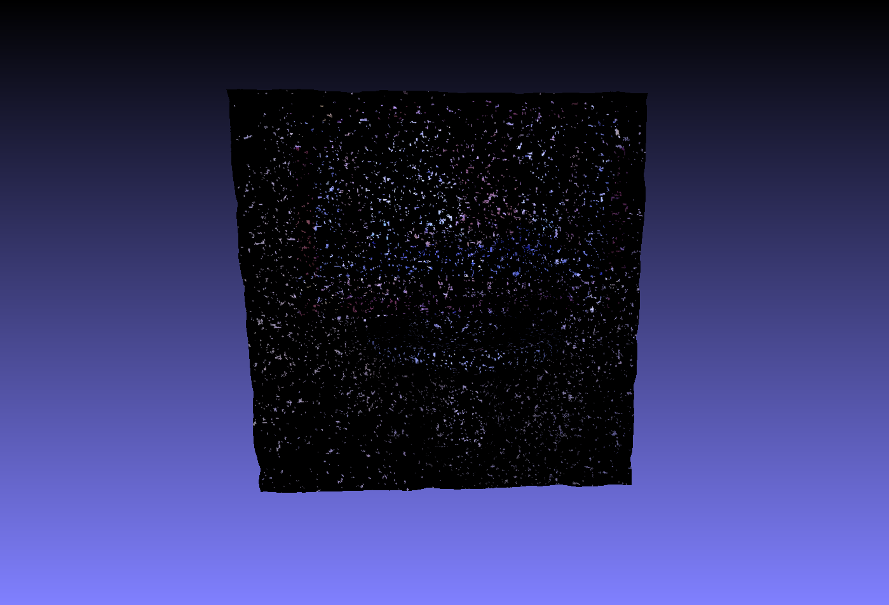
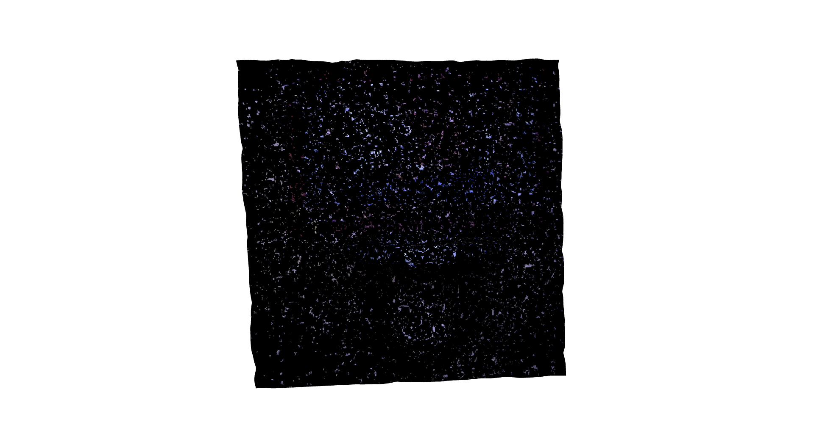
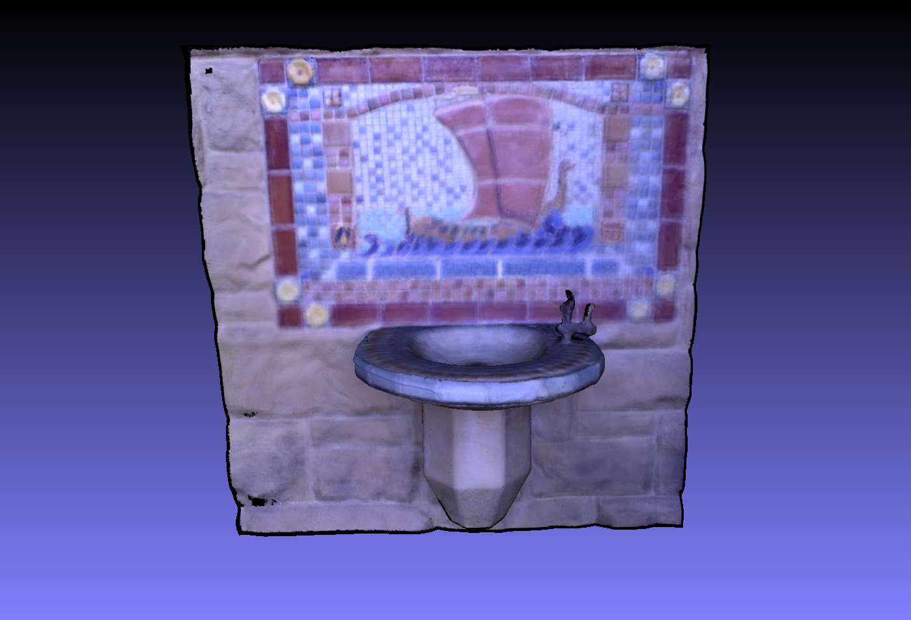
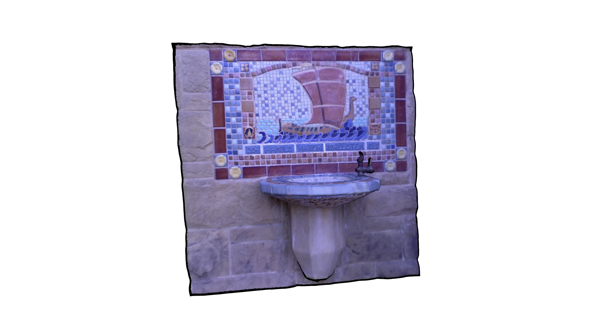

# Z buffering for [Open3D colormap optimization](http://www.open3d.org/docs/tutorial/Advanced/color_map_optimization.html)

Currently, Open3D's colormap optimization determines vertex visibility by 
comparing rendered depth of that vertex with the depth at that point in
the input RGB-D image.

This works fine if the depth map is not very noisy. But if the depth map comes
from a noisy sensor (e.g. Kinect), it creates problems. See [this issue](https://github.com/IntelVCL/Open3D/issues/594)
and the texturing shown below, where artificial noise of 0 mean and 50mm 
stdev was added to the depth maps 
(data from the [Open3D tutorial](http://www.open3d.org/docs/tutorial/Advanced/color_map_optimization.html)):

(above: before optimization)

(above: after optimization)

This repository uses [Open3D's rendering](http://www.open3d.org/docs/tutorial/Advanced/customized_visualization.html)
to render clean depth maps and passes them to the colormap optimization process
to solve this issue. This is equivalent to determining vertex visibility using
Z-buffering, since Open3D rendering performs Z-buffering internally.

The texturing is much better if vertex visibility is determined using Z buffering:

(above: before optimization)

(above: after optimization)
